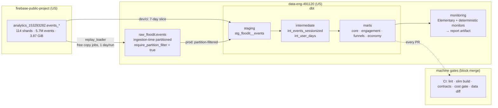

# floodit-analytics

An analytics engineering repository over real mobile-game telemetry — the
public [Flood-It!](https://play.google.com/store/apps/details?id=com.labpixies.flood)
GA4 export (`firebase-public-project.analytics_153293282.events_*`: 114
daily-sharded tables, ~5.7M nested GA4 events) — built to demonstrate an
**AI-amplified analytics workflow**: agents draft the models, tests, docs,
and incident reports; layered machine gates (lint, contracts, cost caps,
data diffs) do the blocking; a human reviews and merges. Nothing merges to
`main` without CI green and a human approval, and **no query anywhere in the
repo runs without a byte cap**.

> Every number in this README comes from a query or run that actually
> happened against project `data-eng-491120` — no estimates, no mock data.
> Where a claim links to a GitHub Actions run or PR, that link is the
> evidence.

## What's here, in one screen

- **114 shards → one partitioned table**, grown one day per run by a replay
  loader that uses **free copy jobs only** (no query cost, idempotent).
- **10 dbt models** (1 staging, 2 intermediate, 7 marts) with **59 tests**,
  every mart contracted and documented, answering real product questions:
  DAU, D1/D7/D30 retention cohorts, the quickplay level funnel, and the
  extra-steps virtual-currency economy.
- **Five-layer cost control**, two layers of which were *deliberately
  tripped* to prove they block rather than warn.
- **A five-job CI pipeline** that lints, slim-builds, enforces contracts,
  dry-run cost-gates, and data-diffs every PR — proven by one PR that passed
  clean and one, sized on purpose, that the cost gate blocked.
- **A deterministic incident injector + monitoring** — four failure classes,
  each firing its monitor live and recovered with one idempotent command.
- **Three agent slash commands** (`/spec-from-ticket`, `/build-from-spec`,
  `/triage-incident`) that were run for real; their outputs (specs, an
  incident RCA, and a merged model PR) are committed as examples.

## Architecture

Full data flow, dataset inventory, event catalog, and the schema-evolution
story are in [docs/architecture.md](docs/architecture.md).

## Cost guardrails — fail-closed, and verified by tripping them

Cost control is layered and fail-closed. **Alerts are not controls**: only
the blocking layers are trusted to stop spend.

| Layer | Mechanism | Blocks or notifies |
|---|---|---|
| Per-query byte cap | `maximum_bytes_billed` on every dbt target, `bq` call, `QueryJobConfig` | **blocks** (fails pre-execution, bills nothing) |
| Partition enforcement | `require_partition_filter = true` on `raw_floodit.events` | **blocks** (BigQuery rejects the query) |
| Free-by-design ops | loader = copy jobs; CI cost gate = dry runs | **blocks** (no billed path exists) |
| Project daily quota | 100 GiB/day query usage (manual, [setup.md](docs/setup.md)) | **blocks** |
| CI cost gate | free dry run per modified model, 1 GiB ceiling | **blocks merge** |
| Budget alert | €5/month, 25/50/100% (Terraform) | notifies only |

Two blocking layers were deliberately violated and the failures recorded:

| Guardrail | Deliberate violation | Observed result |
|---|---|---|
| `maximum_bytes_billed` | Full-range scan (~185 MiB needed) under a 100 MB cap | `bytesBilledLimitExceeded`; **`totalBytesBilled = 0`** — nothing billed |
| `require_partition_filter` | Unfiltered `count(*)` on `raw_floodit.events` | Rejected at validation: *"Cannot query… without a filter over column(s) '_PARTITIONDATE'…"* |
| CI cost gate | A model sized at **1,735.8 MiB** (> 1 GiB gate, < 2 GiB build cap) | [PR #2](https://github.com/rodrenny/floodit-analytics/pull/2) `cost_gate` **failed**; merge impossible under branch protection |

## The gates, proven on real PRs

CI runs five jobs per PR, fail-fast, authenticated to BigQuery via Workload
Identity Federation (**no key files**): **lint** (ruff + SQLFluff) →
**slim build** (`state:modified+`, `--defer` against the manifest from
`main`) → **contract guard** (every mart `contract: enforced`) →
**cost gate** (dry run per modified model, posts a bytes table) →
**data diff** (PK-level `except distinct` vs prod, posts on the PR).

| PR | Intent | Outcome |
|---|---|---|
| [#1](https://github.com/rodrenny/floodit-analytics/pull/1) | clean pass | 4 gates green ([run](https://github.com/rodrenny/floodit-analytics/actions/runs/28724175217)); cost gate posted **132.5 MiB — pass** |
| [#2](https://github.com/rodrenny/floodit-analytics/pull/2) | must be blocked | `cost_gate` **failed** at 1,735.8 MiB ([run](https://github.com/rodrenny/floodit-analytics/actions/runs/28724190811)); closed unmerged |
| [#9](https://github.com/rodrenny/floodit-analytics/pull/9) | agent-built mart | 4 gates green; cost gate **96.4 MiB — pass**; human-merged |

## The agent workflow, end to end

A stakeholder ticket becomes a reviewed, merged model through three
commands ([.claude/commands/](.claude/commands/)) — each run for real, its
output committed:

1. **`/spec-from-ticket`** → a costed spec, or clarifying questions.
   [ticket 001](tickets/examples/ticket_001_extra_steps_d7_retention.md)
   produced [a full spec](specs/ticket_001_extra_steps_d7_retention.md)
   (recon found the grants cluster into 4 clean buckets; model dry-runs at
   ~96 MiB). The deliberately ambiguous
   [ticket 003](tickets/examples/ticket_003_vip_engagement_drop.md) instead
   produced [four numbered questions](specs/ticket_003_vip_engagement_drop.md),
   each grounded in a data fact (only ~1% of users have any LTV revenue) —
   **the command refuses to guess a metric definition**.
2. **Human approves the spec** (flips `status: draft → approved`). The build
   command checks this and refuses to run otherwise.
3. **`/build-from-spec`** → model + tests + docs + PR, verified locally
   first. It produced [PR #9](https://github.com/rodrenny/floodit-analytics/pull/9)
   (`retention_by_extra_steps_grant`), which a human merged.

### The incident-triage story

`/triage-incident` was run against a **live, injected incident**:

1. `loader/incidents.py --null-spike platform 0.35` rewrote one day's
   partition (the documented cost-policy exception — capped, partition-
   filtered).
2. The next prod build fired `monitor_platform_null_rate` (**WARN**).
3. The command gathered evidence cheapest-first (6 capped queries,
   < 60 MB total), matched the runbook signature, walked the dbt lineage
   for blast radius (8 models + 2 exposures), and wrote
   [the RCA report](incidents/2026-07-05_platform_null_spike_report.md).
4. The operational fix — one idempotent `--day` re-copy — restored the
   pristine data; the follow-up build went **95 PASS / 0 WARN**.

All four injectors (`--skip-day`, `--duplicate-day`, `--drop-column`,
`--null-spike`) were demonstrated firing their monitor and recovering; see
the [runbook](docs/runbooks/incident_triage.md).

## What machines enforce here (the compression)

The point isn't "AI writes SQL" — it's that a human's attention is spent
only on review, because everything mechanically checkable is mechanical:

- **6 cost controls**, 3 of them proven blocking by deliberate violation.
- **5 CI gates** per PR + local pre-commit (ruff, SQLFluff, hygiene).
- **59 automated tests** across 10 models; every mart carries a
  PK test **and** a business-invariant test (rates in [0,1], funnel counts
  monotone, denominators bounded).
- **Every mart contracted** — a column added/removed/retyped fails the
  build until a human signs off.
- **Byte budget**: the single largest scan in the whole project was a
  ~405 MiB estimate; every committed model builds under the 1 GiB CI gate;
  the replay and CI cost gate are **zero-cost** by construction.
- **Provenance**: 35 commits, 7 merged PRs, 2 closed (the deliberately
  over-budget guardrail proof, and a stack superseded after a merge-order
  fix) — `git log` reads as the build story, phase by phase.

## Verified metrics (from the built marts)

On the 7-day dev slice (2018-07-01 → 07-07): DAU 414–1,225 (day 1 inflated
by the window edge), D1 retention 9.7–21.9% across the four grant buckets,
quickplay completion rate S .347 / M .311 / L .264 (the Large board *is*
harder).
D7/D30 are correctly **null**, not zero, where the horizon isn't yet
observable — an unobserved future is not churn. Prod has 31 partitions /
1.55M events loaded so far; the loader advances one day per scheduled run.

## Limitations (honest)

- **Obfuscated data.** GA4 export `user_pseudo_id` is device-scoped and
  `user_id` is 100% null; "users" means devices. Geo/version fields are
  coarse. No revenue beyond ad-LTV (~1% of users, max $7.21).
- **It's a replay simulation.** 2018 data is copied forward "as if today";
  event timestamps stay in 2018, which is *why* anomaly monitors are
  deterministic dbt tests rather than Elementary's wall-clock-anchored ones
  (found by testing — see the runbook).
- **No BI layer** (v1 non-goal): consumers are declared as dbt `exposures`
  placeholders, not dashboards.
- **No Airflow** (v1): scheduling is GitHub Actions cron, which maps 1:1 to
  a DAG (`load >> build >> monitor`).
- **Sessionization is derived**, not native: this export predates
  `ga_session_id`, so sessions come from a 30-minute inactivity gap (GA4's
  own timeout).

## What maps to production

- **GitHub Actions cron → Airflow/Dagster DAG**, same three stages.
- **Replay loader → real ingestion** (Fivetran/streaming/scheduled export);
  the copy-job + partition-decorator pattern and idempotency are unchanged.
- **Deterministic monitors → Elementary/Monte Carlo anomaly detection**
  once timestamps are real (the wall-clock assumption holds in prod).
- **WIF + least-privilege CI SA, byte caps, partition enforcement,
  contracts, slim CI, cost gate, data diff** are already production
  patterns, not simulations — they'd ship as-is.

## Layout

| Path | What lives there |
|---|---|
| [CLAUDE.md](CLAUDE.md) | Engineering conventions — the contract agents and humans follow |
| [docs/setup.md](docs/setup.md) | GCP, local, and CI setup |
| [docs/architecture.md](docs/architecture.md) | Data flow, event catalog, guardrail inventory, schema evolution |
| [docs/demo_script.md](docs/demo_script.md) | 3–4 minute demo walkthrough |
| [docs/runbooks/](docs/runbooks/incident_triage.md) | Incident injection & triage runbook |
| [infra/](infra/) | Terraform: datasets, raw table, CI service account, IAM, budget |
| [loader/](loader/) | Replay loader + deterministic incident injectors |
| [dbt/](dbt/) | The dbt project: staging → intermediate → marts |
| [.claude/commands/](.claude/commands/) | Agent slash commands |
| [tickets/](tickets/examples/) · [specs/](specs/) · [incidents/](incidents/) | The agent workflow's inputs and committed outputs |
