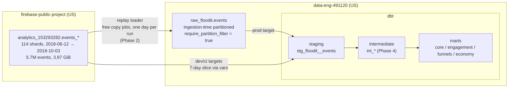

# Architecture

## Data flow

Dev iterates directly against the public dataset (bounded 7-day slice,
`20180701`–`20180707`); prod reads the replayed `raw_floodit.events`
(repointed in Phase 2). Both paths run under `maximum_bytes_billed`.

## Datasets

| Dataset | Purpose | Expiration | Created by |
|---|---|---|---|
| `raw_floodit` | Replayed GA4 events (copy jobs only) | none | Terraform |
| `analytics` | Prod dbt output | none | Terraform |
| `dbt_renny` | Dev dbt target | 7 days | Terraform |
| `dbt_ci` | Slim-CI build target | 7 days | Terraform |

All datasets are labeled `project=floodit-analytics` for billing-export
filtering. The CI service account `floodit-ci` holds `bigquery.jobUser` on
the project and `bigquery.dataEditor` on these four datasets only.

## Schema evolution (discovered during replay)

The GA4 export schema **grew during the window**: `event_value_in_usd`
(by 07-01), `event_bundle_sequence_id` + `event_server_timestamp_offset`
(07-02), `event_dimensions` (by 09-01). The raw table therefore carries the
**superset schema** (vendored from the last shard, `events_20181003`);
early days hold NULLs in late-added fields. Copy jobs accept
narrower-schema sources into the superset table (verified with a probe
before adopting) — exactly how a production warehouse absorbs upstream SDK
evolution.

## Raw table design

`raw_floodit.events` is **ingestion-time partitioned** (`_PARTITIONDATE`)
with a schema byte-identical to the public shards
([infra/events_schema.json](../infra/events_schema.json)). That combination
is deliberate:

- copy jobs into `events$YYYYMMDD` decorators are **free** and idempotent
  (`WRITE_TRUNCATE` per partition) — a column-partitioned table would force
  a schema tweak and a query-based (billed) load;
- `require_partition_filter = true` makes BigQuery itself reject any
  unfiltered query, no matter who or what wrote it.

The cost is that models filter on `_PARTITIONDATE` rather than a natural
column; staging translates it into `event_date` for everything downstream.

## Event inventory (verified on the 7-day dev slice, 350,000 events)

Top event types by volume — counts are real query results, not estimates:

| event_name | events | users | key params |
|---|---:|---:|---|
| `screen_view` | 124,215 | 2,225 | firebase_screen_class, firebase_screen_id |
| `user_engagement` | 91,064 | 1,944 | engagement_time_msec |
| `level_start_quickplay` | 35,098 | 1,498 | board |
| `level_end_quickplay` | 24,566 | 1,281 | board |
| `post_score` | 15,994 | 1,140 | score, level, level_name, time |
| `level_complete_quickplay` | 11,896 | 735 | board, value (steps remaining) |
| `level_fail_quickplay` | 9,382 | 843 | board |
| `level_reset_quickplay` | 6,956 | 333 | board |
| `select_content` | 5,596 | 1,244 | content_type, item_id |
| `session_start` | 4,670 | 1,801 | — |
| `level_start` | 4,513 | 444 | level, level_name |
| `level_end` | 3,359 | 395 | level, level_name |
| `level_retry` | 2,608 | 330 | level, level_name |
| `level_retry_quickplay` | 2,216 | 374 | board |
| `level_up` | 1,970 | 316 | level, value |
| `level_complete` | 1,691 | 280 | level, level_name, value |
| `level_fail` | 1,102 | 208 | level, level_name |
| `spend_virtual_currency` | 481 | 134 | item_name, value, virtual_currency_name |
| `level_reset` | 445 | 124 | level, level_name |
| `use_extra_steps` | 404 | 110 | virtual_currency_name, item_name, value |

Below the top 20 but load-bearing for marts: `first_open` (176 — retention
cohort anchor), `no_more_extra_steps` (177), `ad_reward` (122),
`app_remove` (148), `app_exception` (353).

`*_quickplay` events describe the endless quick-play mode (levels keyed by
`board` size); the bare variants describe progressive mode (levels keyed by
`level`/`level_name`).

## Schema findings that shape the models

- **No `ga_session_id`.** This 2018 export predates the param. Sessions
  will be derived in `int_events_sessionized` (Phase 4) from
  `session_start` events and engagement gaps.
- **`user_id` is 100% null**; `user_pseudo_id` (device-scoped, never null)
  is the user identifier everywhere.
- **No native event id**: staging builds `event_pk` as a surrogate over
  (user_pseudo_id, event_at, event_name, repeat number).
- **Mixed param types.** `level` and `value` arrive as int for some events
  and float for others; the `extract_param(..., 'numeric')` macro coalesces
  the numeric slots.
- **User properties** carry the economy experiment context:
  `initial_extra_steps` (starting grant bucket — extracted),
  `ad_frequency`, `plays_quickplay`/`plays_progressive`,
  `num_levels_available`, and `firebase_exp_1/3/4/5` A/B buckets
  (not yet extracted; add when a mart needs them).
- **Platform** is exactly `{ANDROID, IOS}` (tested via `accepted_values`).

## Guardrail inventory

| Layer | Mechanism | Blocks or notifies |
|---|---|---|
| Per-query byte cap | `maximum_bytes_billed` on every dbt target, `bq` call, and `QueryJobConfig` | **blocks** (fails pre-execution, bills nothing) |
| Schema-level partition enforcement | `require_partition_filter = true` on `raw_floodit.events` | **blocks** (BigQuery rejects the query) |
| Free-by-design operations | loader = copy jobs; CI cost gate = dry runs | **blocks** (no query path exists) |
| Project daily quota | 100 GiB/day query usage (manual, docs/setup.md) | **blocks** |
| Budget alert | €5/month, 25/50/100% thresholds (Terraform) | notifies only |
| Dev-dataset expiry | 7-day default table expiration on `dbt_renny`/`dbt_ci` | storage hygiene |

| CI: lint | ruff + SQLFluff (dbt templater) on every PR | **blocks merge** |
| CI: slim build | `dbt build state:modified+` on the dev slice, 2 GiB cap | **blocks merge** |
| CI: contract guard | every mart must set `contract: enforced` | **blocks merge** |
| CI: cost gate | free dry run per modified model, 1 GiB ceiling, bytes table posted on PR | **blocks merge** |
| CI: data diff | PK-level `except distinct` vs prod, posted on PR | informs review |
